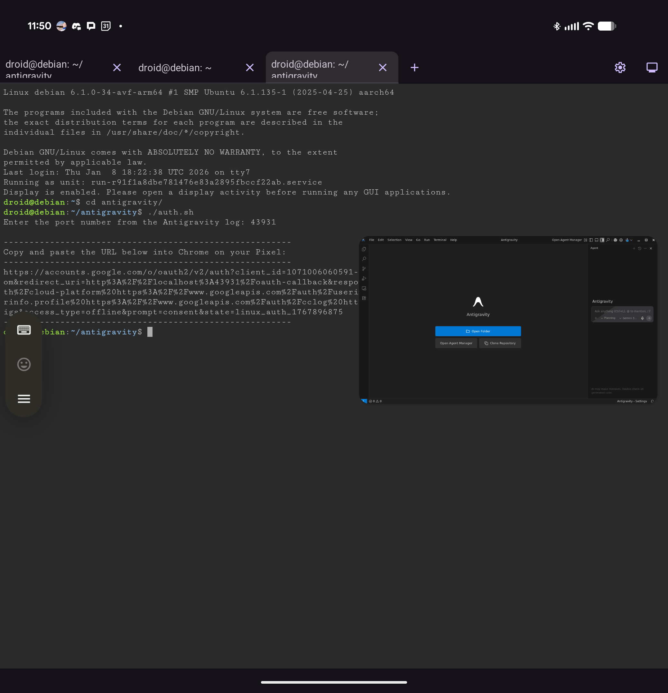

# Tutorial: Running Google Antigravity on Pixel 10 Pro (Debian Terminal)

> **Validated on:** Pixel 10 Pro Fold (Android 16, Jan 2026 Security Patch).

This guide documents how to install, authenticate, and maintain a development workflow for Google Antigravity on a Pixel 10 Pro (or Fold) using the Android 16 Terminal app.

## The Concept

We are running desktop software in an isolated Linux Virtual Machine (AVF).

*   **Auth:** Requires a manual bridge (the browser cannot see the VM).
*   **Clipboard:** Requires a relay tool (the VM is isolated).
*   **Files:** Uses GitHub as a bridge between Android storage and Linux.

## Prerequisites

*   Pixel 10 / 10 Pro / Fold (Android 16)
*   Android Terminal enabled in Settings.
*   **A GitHub account** with a Personal Access Token created.
*   A Bluetooth keyboard/mouse (Highly recommended).

## Step 1: Prepare the Linux Environment

Open the Terminal app. We need to install standard tools and the clipboard manager.

1.  Update the package lists and upgrade existing packages:
    ```bash
    sudo apt update -y && sudo apt upgrade -y
    ```

2.  Install `gpg` (for the installer), `git` (for version control), and `wl-clipboard` (for copy/paste support):
    ```bash
    sudo apt install gpg git wl-clipboard
    ```

3.  **Configure Git Identity:**
    ```bash
    git config --global user.name "Your Name"
    git config --global user.email "your@email.com"
    git config --global credential.helper store
    ```
    *(The store helper saves your token so you only have to paste it once).*

## Step 2: Install Antigravity

1.  Navigate to `https://antigravity.google/download` on your phone.
2.  Follow the standard Linux installation instructions provided on the page.
3.  Once the installation completes, run a final update:
    ```bash
    sudo apt update && sudo apt upgrade
    ```

## Step 3: Launch the GUI

Start the application by typing:
```bash
antigravity
```

*   **To see the interface:** Tap the Display Icon in the top right corner of the Terminal app window (looks like a small monitor).

    

*   **Important:** The Terminal will request permission to open ports several times. Approve **all** port requests.

## Step 4: The Authentication Bridge

The VM is isolated, so "Sign In" fails to redirect automatically. We must bridge it manually.

1.  **Trigger Sign-in:** In the Antigravity GUI, click "Sign in."
2.  **Approve Port:** Note the port number requested by the Terminal.

### A. The Helper Script

Create a script using `nano auth.sh` to generate your login URL:

```bash
#!/bin/bash
read -p "Enter port: " port
CLIENT_ID="1071006060591-tmhssin2h21lcre235vtolojh4g403ep.apps.googleusercontent.com"
SCOPES="https%3A%2F%2Fwww.googleapis.com%2Fauth%2Fcloud-platform%20https%3A%2F%2Fwww.googleapis.com%2Fauth%2Fuserinfo.email%20https%3A%2F%2Fwww.googleapis.com%2Fauth%2Fuserinfo.profile%20https%3A%2F%2Fwww.googleapis.com%2Fauth%2Fcclog%20https%3A%2F%2Fwww.googleapis.com%2Fauth%2Fexperimentsandconfigs"
REDIRECT="http%3A%2F%2Flocalhost%3A${port}%2Foauth-callback"
URL="https://accounts.google.com/o/oauth2/v2/auth?client_id=${CLIENT_ID}&redirect_uri=${REDIRECT}&response_type=code&scope=${SCOPES}&access_type=offline&prompt=consent&state=$(date +%s)"
echo "$URL"
```

Make it executable:
```bash
chmod +x auth.sh
```

### B. The Bridge

1.  Run the script: `./auth.sh` -> Enter Port -> Copy URL.
2.  Paste URL in Chrome (Android) -> Sign In.
3.  Wait for `ERR_CONNECTION_REFUSED`.
4.  Copy the **failed URL** from Chrome.
5.  In Terminal:
    ```bash
    curl "PASTE_FAILED_URL_HERE"
    ```

## Step 5: Git Setup (Personal Access Token)

GitHub requires a token instead of a password.

1.  **Generate Token:** On GitHub (Settings -> Developer -> Personal Access Tokens), generate a token.
    *   **Fine-grained tokens (Recommended):** Restricted to specific repositories.
    *   **Tokens (classic):** Easier to set up but broader access. Ensure `repo` scope is selected.
2.  **Initialize Repo (if starting fresh):**
    ```bash
    cd ~/YourProject
    git init
    git remote add origin https://github.com/USER/REPO.git
    ```
3.  **Push & Authenticate:**
    ```bash
    git add . && git commit -m "Init"
    git push -u origin main
    ```
4.  **Enter Password:** When asked for a password, **paste your Token**.
    *   *Tip: Use the clipboard trick below to paste the long token.*

## Step 6: The "Image Loop"

To transfer screenshots from Android to the Linux VM.

1.  **Capture:** Take screenshot on Pixel.
2.  **Upload:** Open Chrome -> Go to GitHub Repo -> Add File -> Upload files -> Select Screenshot.
3.  **Download:** In Terminal:
    ```bash
    git pull origin main
    ```
4.  **Use:** The image is now in your Linux directory.

## Reference: Android-to-Linux Clipboard

The Antigravity GUI cannot see the Android clipboard. Use this relay:

1.  Copy text on Android.
2.  **Terminal:** Type `wl-copy` -> Press **Enter**.
3.  **Terminal:** Paste text -> Press **Enter** -> Press **Ctrl+D**.
4.  **GUI:** Press **Ctrl+V**.

## Gallery

Here is Antigravity running on the Pixel 10 Pro Fold:




